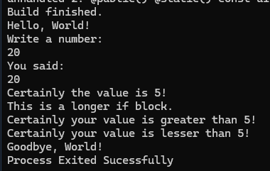

Having free time today, i decided to spend my day building another component of the Abstract
Development system.

<!-- truncate -->

There's some time since i started to try to make things get on rails and properly execute some code,
but this is a really hard thing to do as assembly is hard as fuck and completelly plataform and arch
dependent. So for say i'm doing some progress, i decided to spend some time working on the interpreter
that will be used by the Abstract System Tools to execute build and comptime scripts. Obviously i don't
want something so limited as just builds, The interpreter should be able to run any Abstract-based
program that can (obviously) be executed and is platform independent.

## About the Interpreter

The interpreter structure is simple:

It is compiled into an executable aplication, to be acessible to command line. As the compiler is fully
made on C#, i'm also using some .NET features to allow me call the interpreter from the compiler process,
without needing to start another process.

The interpreter is really simple, it have a main class to handle the process, a class to randle program
resources (types and functions repositories) extracted directly from the elf and dependences, and a
simple virtual machine that verifies and execute each OpCpde acordingly. At the moment, it's not optimized
and tbh i don't meassured any time (maybe i back with some good measurements in next posts!) as i'm just
working with the possibility to be able to execute the programs and see if the semantic parsing, binary
references and optimizations during evaluation process are OK. 

The interpreter also have a C# implementation of the Abstract's standard library. Still not complete, but
already working.

The interpreter functionality is simple, it use loops to handle each binary opcode in the final asembled
ElF and use LINQ to resolve references such as method calls. For the standard library, it use a lot of
reflection (really unoptimized by now lol) to search the respective types and functions on the C# script
with the same structure (namespaces and types being replaced by neasted abstract classes).

## Code And Results

This is the current script that i'm using to test the compiler (yeah, no unit tests for now lol
maybe one day)

```abs
namespace MyProgram {

  func void main() {

    Std.Console.log("Hello, World!")

    Std.Console.log("Write a number:")
    
    let i32 thing = 20
    let i32 value = Std.Console.read() as i32

    Std.Console.log("You said:")
    Std.Console.log(value)

    if value == 5 => Std.Console.log("Certainly the value is 5!")
    elif value > 5 => {
        Std.Console.log("This is a longer if block.")
        Std.Console.log("Certainly your value is greater than 5!")
    }
    else => Std.Console.log("Certainly your value is lesser than 5!")

    # /!\ arrays working are temporarely halted
    # /!\ due focusing on main things
    # /!\ (next update we probably will have some cool arrays)

    # let []i64 longArray = []
    # let []i32 integerArray = []
    # let []i16 shortArray = []
    # let []i8 byteArray = []

    # Std.Console.log( integerArray[4] )

    # Std.Console.log(longArray)
    # Std.Console.log(integerArray)

    Std.Console.log("Goodbye, World!")

  }
}
```

It is a really simple program, just to see if the main OpCodes (calls, sets and gets and converts) are
properly working.

This program should just display a hello message, ask for a number, test it, sending some messages
depending of the test's result, and display a goodbie message.

As the result, i'm getting it at the moment:



Nothing so much increadble, but i'm really happy that it's finally showing some result.
Obviously it's noticeable how the condition tests are not being tested, as it is something that i will
still implement (I spent the entire day handling method calls and reflection).

This is all for today, see you in the future!
