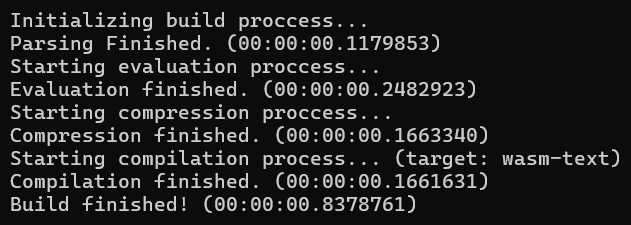

After some time without documenting anything, I finally cound bring some results
about the compiler.

<!-- truncate -->

The current version of the compiler can finish the entire pipeline very well and very fast.
The current version logs some branchmarks. Here are the result time on the, also following,
machine specifications:

