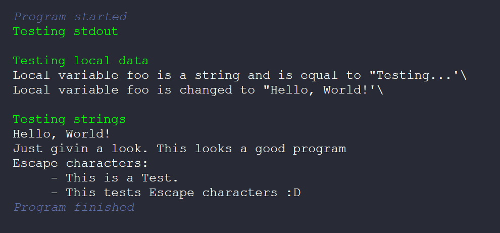

After some time without documenting anything, I finally cound bring some results
about the compiler.

<!-- truncate -->

The current version of the compiler can finish the entire pipeline very well and very fast.
The current version logs some branchmarks. Here are the result time on the, also following,
machine specifications:


| Components | Specs |
|:----------:|:-----:|
| Operational system | Windows 11 |
| Processor | AMD Ryzen7 5700u |
| Memory | 8 GB |

In the current state of the compiler, I'm using this script to test things:

```abs
func void main() {
    Std.Console.writeln("{Console.CSIFGColor.lightGreen}Testing stdout{Console.CSIGeneral.reset}")

    Std.Console.writeln("\n{Console.CSIFGColor.lightGreen}Testing local data{Console.CSIGeneral.reset}")

    let string foo = "Testing..."
    Std.Console.writeln("Local variable foo is a string and is equal to \"" + foo + "\"");
    foo = "Hello, World!"
    Std.Console.writeln("Local variable foo is changed to \"" + foo + "\"");

    Std.Console.writeln("\n{Console.CSIFGColor.lightGreen}Testing strings{Console.CSIGeneral.reset}")

    Std.Console.writeln(foo)

    foo = "Just givin a look."
    Std.Console.writeln(foo + " This looks a good program.")

    Std.Console.writeln("Escape characters:")
    Std.Console.writeln("\t - This is a Test.\n\t - This tests Escape characters :D")
}
```

This simple program is designed for:
- Test the standard output;
- Test local variables;
- Test strings and string concatenation;
- Test a bare memory allocation.

This is the result of the program (show in a web terminal emulator):


It is possible still see some problems related to string concatenation, but that i will
be fixing soon. In the general, everything seems to be working fine and the development
will continue on rails :)

